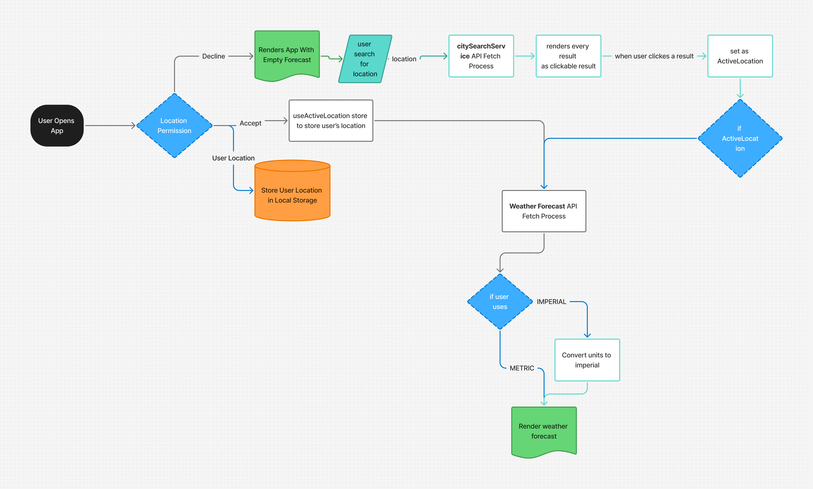
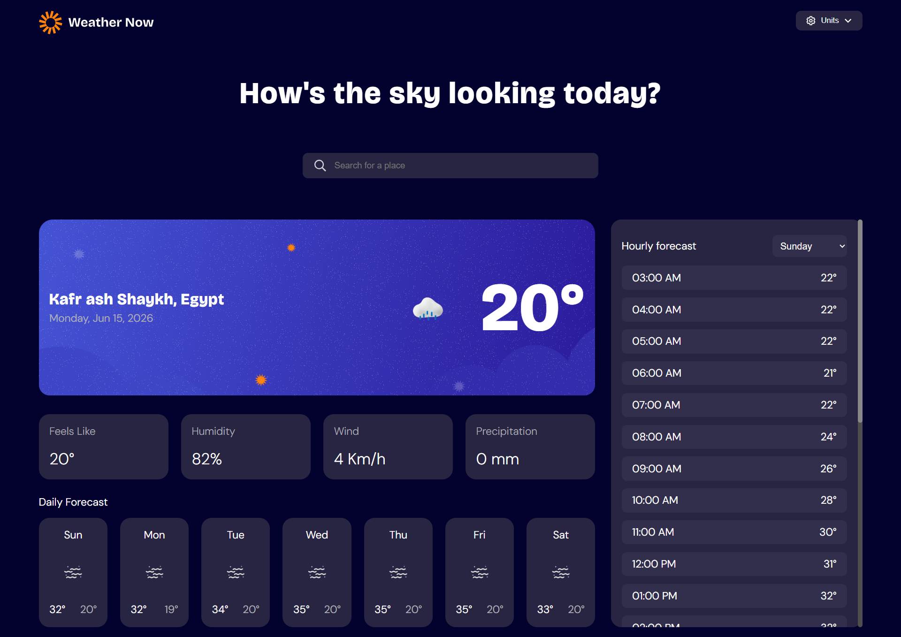
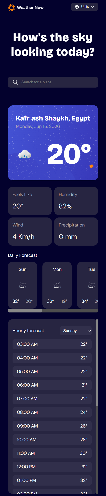

# Weather App

## Overview

### Description

A modern weather application that allows users to search for any location and view real-time weather information. The application integrates with the Open-Meteo API to provide accurate weather data, including current conditions, temperature, wind speed, humidity, and forecast details.

The project was built as a frontend challenge with a focus on responsive design, API integration, performance optimization, and user experience.

### Goals

- Provide accurate and real-time weather information.
    
- Deliver a clean, responsive, and accessible user interface.
    
- Practice API integration and state management in a modern frontend application.

---

## Tech Stack

### Frontend

- Next.js
- TypeScript
- CSS Modules 

### Database

- None

### State Management

- Zustand (Client Side State)
- TanStack Query (Server Side State)

### Deployment & Hosting

- Vercel

---

## Features

### Core Features

- Search weather information by city or location.
    
- View current weather conditions.
    
- Display temperature, weather status, and weather icons.
    
- Show additional weather metrics:
    
    - Humidity
        
    - Wind Speed
        
    - Visibility
        
    - Feels Like Temperature
        
- Responsive design for desktop and mobile devices.

---

## Architecture

### High-Level Architecture

1. Users search for a location.  
2. TanStack Query handles data fetching, caching, and synchronization with the Open-Meteo APIs.  
3. Weather data is stored in the TanStack Query cache.  
4. Zustand manages client-side UI state such as search history, selected locations, or user preferences.  
5. React components consume cached data and render the UI.  
6. CSS Modules provide scoped component styling.



---

## Project Structure

```text
## Project Structure

```text
weather-app/
├── app/
│   ├── layout.tsx
│   ├── page.tsx
│   ├── globals.css
│   │
│   └── components/
│       ├── SearchBar/
│       │   ├── SearchBar.tsx
│       │   └── SearchBar.module.css
│       │
│       └── WeatherCard/
│           ├── WeatherCard.tsx
│           └── WeatherCard.module.css
│
├── public/
│
├── services/
│   ├── weatherApi.ts
│   └── geocodingApi.ts
│
├── store/
│   └── weatherStore.ts
│
├── utils/
│
├── .env.local
├── next.config.ts
├── package.json
└── README.md
```

---

## Installation

### Prerequisites

- Node.js (v18 or later)
    
- npm

### Setup

```bash
git clone <repository-url>

cd weather-app

npm install

npm run dev
```

The application will be available at:

```text
http://localhost:3000
```

---

## API Integration

### APIs Used

|API|Purpose|
|---|---|
|Open-Meteo Weather API|Retrieve weather data|
|Open-Meteo Geocoding API|Convert location names into coordinates|

---

## Screenshots

### Desktop View



### Mobile View



---

## Design Decisions

### Key Technical Choices

#### Next.js App Router

- Decision: Use Next.js App Router.  
- Reason: Modern routing, server components, and optimized performance.

#### Zustand

- Decision: Use Zustand for client state management.  
- Reason: Lightweight, simple API, and minimal boilerplate.

#### TanStack Query

- Decision: Use TanStack Query for server state management.  
- Reason: Provides caching, background refetching, loading states, and error handling out of the box.

#### Open-Meteo API

- Decision: Use Open-Meteo instead of paid weather services.
    
- Reason: Free, reliable, and does not require API keys.

#### CSS Modules

- Decision: Use CSS Modules for styling.  
- Reason: Scoped styles, easy maintenance, and no runtime overhead.

---

## Challenges & Solutions

### Challenge 1

**Problem**

Converting user-entered city names into coordinates required by the weather API.

**Solution**

Integrated the Open-Meteo Geocoding API as an intermediate step before requesting weather data.

### Challenge 2

**Problem**

Managing loading and error states during API requests.

**Solution**

Implemented dedicated UI states for loading, success, and error scenarios to improve user experience.

---

## Performance Considerations

- Debounced search requests.
    
- Component memoization where appropriate.
    
- Efficient API request handling.
    
- Lazy loading of non-critical assets.
- TanStack Query caching reduces unnecessary API requests.
- Optimized rendering through reusable components.

---

## Security Considerations

- Environment variables used for API configuration.
    
- Input validation for search queries.
    
- Sanitized user input before API requests.
    
- Error handling to prevent exposing internal application details.

---

## Known Limitations

- Requires an internet connection.
    
- Weather accuracy depends on Open-Meteo data availability.
    
- Limited historical weather information.
    
- No offline support.

---

## Roadmap

- [x]  7-Day weather forecast.

- [x] Geolocation-based weather detection.

- [ ] Error handling for invalid locations.

- [ ] Loading states during API requests.

- [ ] Favorite locations.

- [ ] Multi-language support.

---

## Lessons Learned

- Working with third-party APIs.
    
- Handling asynchronous data fetching.
    
- Managing application state effectively.
    
- Structuring scalable React applications.

---

## License

MIT License

Copyright (c) 2026
