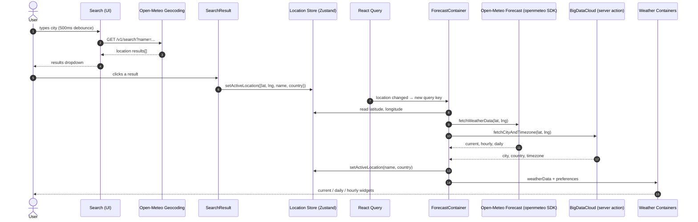

# Weather Now

## Overview

**Weather Now** is a real-time weather application built as part of a **Frontend Mentor hackathon**. Users can search for any city, let the app detect their location via the browser geolocation API, and view current conditions plus hourly and daily forecasts. All data comes from the free, keyless **Open-Meteo** APIs.

Key capabilities:

- Search by city name (debounced) with a country-flag results dropdown.
- Browser geolocation for "current location" weather on first load.
- Current conditions widget: temperature, feels-like, humidity, wind, precipitation.
- 7-day daily forecast and 24-hour hourly forecast.
- Metric/imperial unit switching (Celsius/Fahrenheit, km/h/mph, mm/in) from a Units dropdown.
- Fully responsive dark UI styled with CSS Modules.

## Tech Stack

| Layer | Technology |
|---|---|
| Framework | Next.js 16 (App Router) |
| UI | React 19, TypeScript |
| Client state | Zustand |
| Server state | TanStack Query (React Query) |
| Styling | CSS Modules + design tokens in `globals.css` |
| Weather data | Open-Meteo (via the `openmeteo` SDK) |
| Geocoding | Open-Meteo Geocoding API |
| Reverse geocode + timezone | BigDataCloud (needs `REVERSE_GEOCODING_WITH_TIMEZONE_API` env var) |
| Fonts | Local DM Sans + Bricolage Grotesque (`next/font/local`) |
| Deploy | Vercel |

Scripts: `npm run dev`, `npm run build`, `npm run start` (port 3030), `npm run lint`.

## Project Structure

```text
weather-now/
├── app/
│   ├── layout.tsx              # Root layout: fonts, metadata, globals.css
│   ├── page.tsx                # Client page composing Nav, Header, Search, ForecastContainer
│   ├── not-found.tsx           # 404 → Not-Found component
│   ├── fonts.ts                # Local font registration (DM Sans, Bricolage)
│   └── globals.css             # CSS custom properties / design tokens
│
├── components/
│   ├── MainContainer/          # Layout shell (<main>)
│   ├── Nav/                    # Logo + Units dropdown trigger
│   ├── Header/                 # Page heading
│   ├── Search/                 # Debounced city search + results dropdown
│   ├── SearchResult/           # One result row; sets active location on click
│   ├── ForecastContainer/      # Orchestrates fetching + the three forecast sections
│   ├── CurrentWeatherContainer/ + CurrentWidget/ + SmallWidget/
│   ├── DailyForecastContainer/ + DailyForecastDay/
│   ├── HourlyForecastContainer/ + OneHourForecast.tsx/ + SelectDay/
│   ├── DropdownButton/ + UnitsContainer/ + UnitOption/ + SwitchButton/
│   └── Not-Found/
│
├── services/                   # API layer
│   ├── fetchWeatherData.ts             # Open-Meteo forecast (openmeteo SDK)
│   ├── citySearchService.ts            # Open-Meteo geocoding search
│   ├── reverseGeocodingWithTimezone.ts # BigDataCloud (server action)
│   └── geolocationApi.ts               # navigator.geolocation wrapper
│
├── store/                      # Zustand stores
│   ├── userActiveLocation.store.ts
│   ├── preferences.store.ts
│   └── ui.store.ts
│
├── utils/
│   └── unitConverting.ts       # C→F, km/h→mph, mm→in converters
│
├── public/                     # Icons, weather images, fonts
├── design/  ·  docs/  ·  style-guide.md   # Hackathon design assets
├── .env                        # REVERSE_GEOCODING_WITH_TIMEZONE_API
├── next.config.ts  ·  tsconfig.json  ·  eslint.config.mjs
└── package.json
```

Path alias `@/*` maps to the project root.

## Code Flow

1. **Bootstrap** — `app/page.tsx` (a `"use client"` page) renders `MainContainer` → `Nav`, `Header`, `Search`, and wraps `ForecastContainer` in a `QueryClientProvider`.

2. **Search** — `Search.tsx` debounces keystrokes (500 ms) and calls `fetchLocationCoordinates` (`services/citySearchService.ts`), which hits the Open-Meteo Geocoding API. Each `SearchResult` renders the city with a flag (circle-flags CDN) and, on click, calls `setActiveLocation` on the location store.

3. **Fetch** — `ForecastContainer` (inside React Query) subscribes to the location store. On mount it also requests browser geolocation via `getUserLocation()` (`services/geolocationApi.ts`), which persists coordinates to `localStorage` and updates the store. When a valid lat/lng exists, `useQuery` with key `["weatherData", latitude, longitude]` runs `fetchWeatherData` (current/hourly/daily from Open-Meteo) in parallel with `fetchCityAndTimezone` (BigDataCloud, server action). The reverse-geocoded city/country name is written back into the location store via a `useEffect`.

4. **Render** — The three forecast containers consume the fetched data:
   - `CurrentWeatherContainer` shows the current temp + feels-like/humidity/wind/precipitation `SmallWidget`s.
   - `DailyForecastContainer` maps daily max/min temps into `DailyForecastDay` cards (weekday labels).
   - `HourlyForecastContainer` slices the first 24 hours into `OneHourForecast` rows with a `SelectDay` dropdown.

5. **Units** — `Nav` → `DropdownButton` toggles a sidebar (UI store) that shows `UnitsContainer`, which lists temperature/wind/precipitation `UnitOption`s plus a `SwitchButton` to flip the whole system. All choices live in the preferences store; every forecast component reads those flags and converts values with `utils/unitConverting.ts`.

## Diagrams

### Sequence diagram — user flow



## State Management

Zustand stores (all client-side):

- **`userActiveLocation.store.ts`** — `location { name, country, latitude, longitude }` + `setActiveLocation`. Source of truth for where the app is showing weather.
- **`preferences.store.ts`** — `isMetric` plus per-measurement flags (`isCelsius`, `isKm`, `isMm`) and `toggle*` actions. `toggleMetricSystem` flips all three at once.
- **`ui.store.ts`** — `sidebarOpen` + `toggleSidebar` to show/hide the Units panel.

TanStack Query owns all server state: the weather/reverse-geocode payload is cached by coordinate pair, giving deduplication, background refetch, and built-in loading/error states.

## APIs

| API | Used for |
|---|---|
| Open-Meteo Forecast API (`https://api.open-meteo.com/v1/forecast`) | Current conditions, hourly temp, daily min/max + weather code (via `openmeteo` SDK) |
| Open-Meteo Geocoding API | City name → coordinates |
| BigDataCloud reverse-geocode-with-timezone | Coordinates → city/country name (requires `REVERSE_GEOCODING_WITH_TIMEZONE_API`) |
| circle-flags CDN | Country flag SVGs in search results |

No API keys are required for Open-Meteo; only the BigDataCloud env var is needed.

## Design Decisions

- **React Query for server state, Zustand for UI state** — clean separation; forecasts are cached/deduped while preferences and location stay in lightweight stores.
- **Co-located CSS Modules** — each component ships with its own `.module.css`, scoped at build time with no runtime overhead.
- **Design tokens** — a single `:root` block in `globals.css` defines the neutral/blue palette and spacing scale, keeping colors consistent across components.
- **Open-Meteo** — free and keyless, chosen over paid weather providers for a hackathon.
- **Local fonts** — self-hosted woff2 via `next/font/local` for performance and offline reliability.

## Current State & Known WIP

Most of the hackathon TODOs have been addressed; remaining known gaps:

- `SelectDay` is functional but still a native `<select>` (TODO to swap for a custom styled listbox).
- Error handling lives in `ForecastContainer` (loading/empty/error states with a Retry button), but search and geolocation services still swallow failures silently (TODOs remain to route those into a global error state).
- The temperature data from Open-Meteo is returned in Celsius and converted client-side based on the preferences store.

## Getting Started

```bash
npm install
# create .env with: REVERSE_GEOCODING_WITH_TIMEZONE_API=<your key>
npm run dev
```

Open `http://localhost:3000`. Design references live in `design/`, `docs/`, and `style-guide.md`.
